<div align="center">
  
</div>

# Smart Attendance Management System (SAMS)

<div align="center">
  
  
  
  
  
  
  
  
  
  
</div>

<div align="center">
  
  
  **Mark Jere Soltam Ayala Gementiza**
  
  23 years old • BSIT Student
  
  🎓 Agusan del Sur State College of Agriculture and Technology
  
  *Passionate about mobile app development and creating solutions that help students manage their finances effectively. This project represents my journey in React Native development and my commitment to building practical applications for the student community.*
  
  [](https://github.com/markjeresoltam21)
  [](#)
  
</div>

---

## 📋 Table of Contents

- [Overview](#overview)
- [Features](#features) 
- [Screenshots](#screenshots)
- [System Architecture](#system-architecture)
- [Installation](#installation)
- [User Roles](#user-roles)
- [User Accounts](#user-accounts)
- [API Documentation](#api-documentation)
- [GitHub Repository](#github-repository)
- [Contributing](#contributing)
- [License](#license)

---

## 🎯 Overview

A comprehensive mobile-based attendance tracking system built with React Native, Expo, and Firebase. SAMS provides a complete solution for educational institutions to manage student attendance with real-time data synchronization, advanced analytics, and user-friendly interfaces for both administrators and students.

## Features

- 🔐 **Secure Authentication** - Role-based login system for Admin and Client users
- 👥 **User Management** - Complete CRUD operations with profile images
- 📊 **Attendance Tracking** - Easy marking with sorting and CRUD operations
- 📈 **Data Visualization** - Pie charts (admin) and bar charts (client) for insights
- 📱 **Mobile-First Design** - Responsive UI optimized for mobile devices
- 🔥 **Firebase Backend** - Real-time data sync with Firestore
- 🎨 **Modern UI** - Clean interface with floating action buttons
- 📄 **PDF Reports** - Generate attendance reports with date filtering
- 🔔 **Push Notifications** - Daily attendance reminders at 9:00 AM
- 📸 **Profile Images** - Upload and display user avatars
- 📊 **Advanced Analytics** - Track present/absent trends with visual charts

## Screenshots

<div align="center">

### Login & Registration
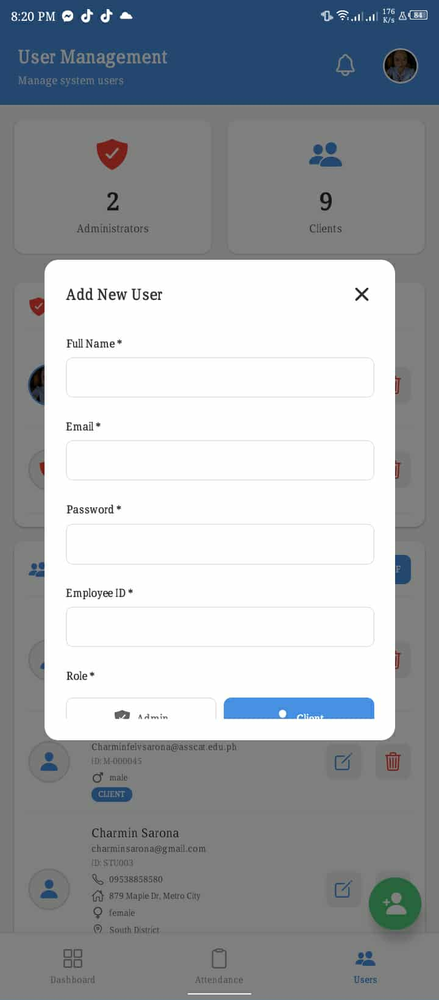
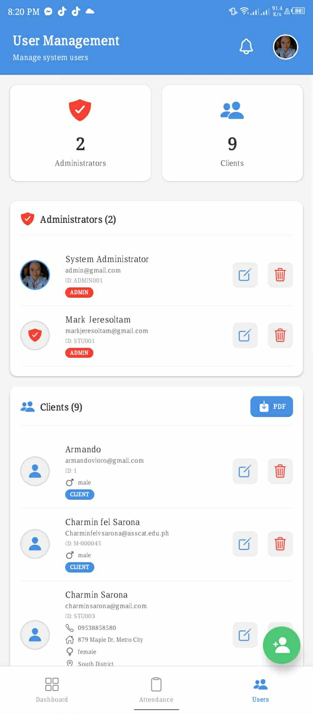

### Admin Dashboard
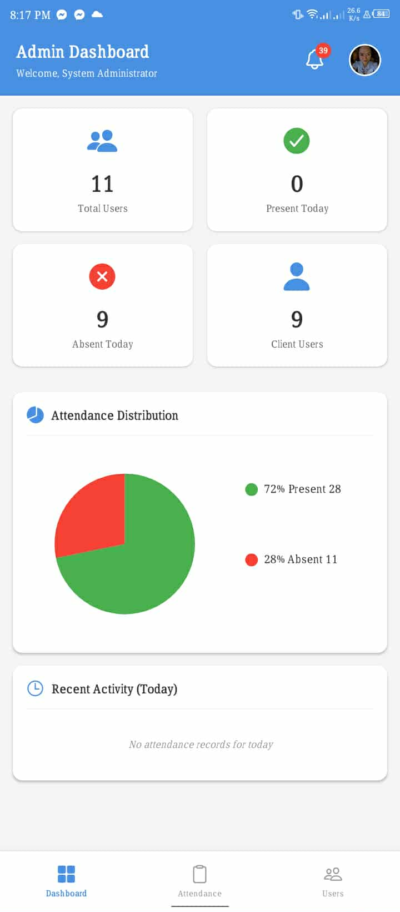
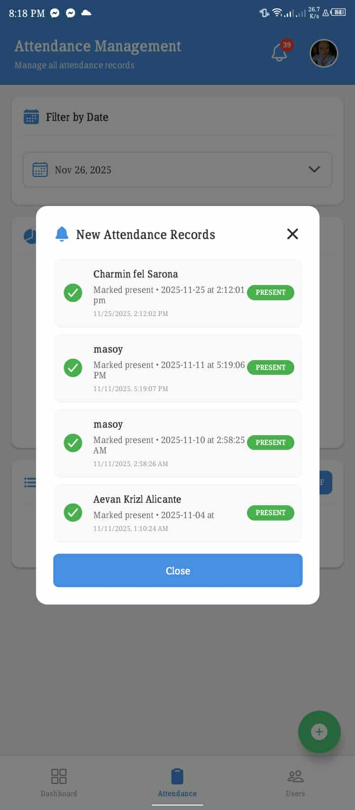
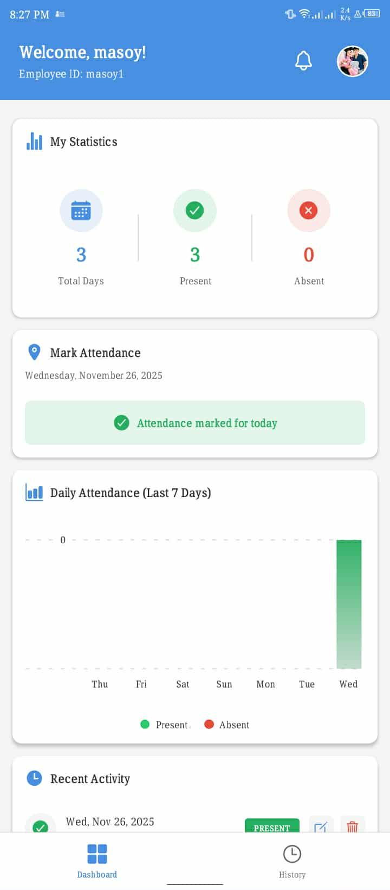

### Client Dashboard
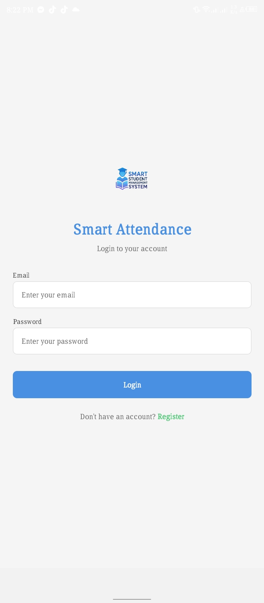
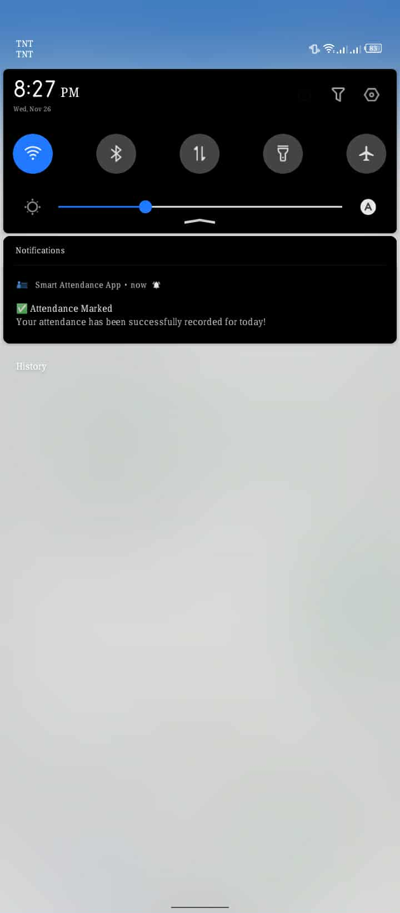

### User Management & Profile
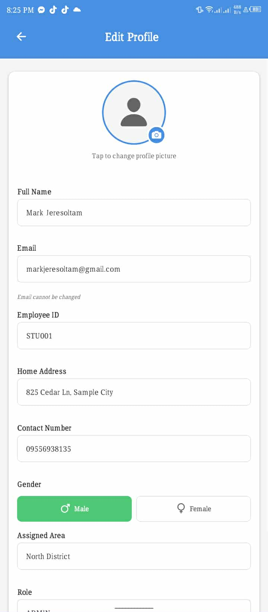
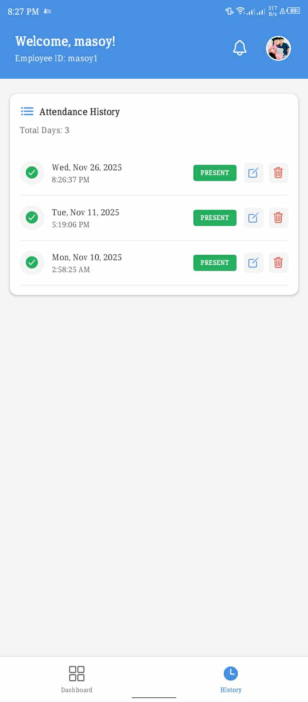
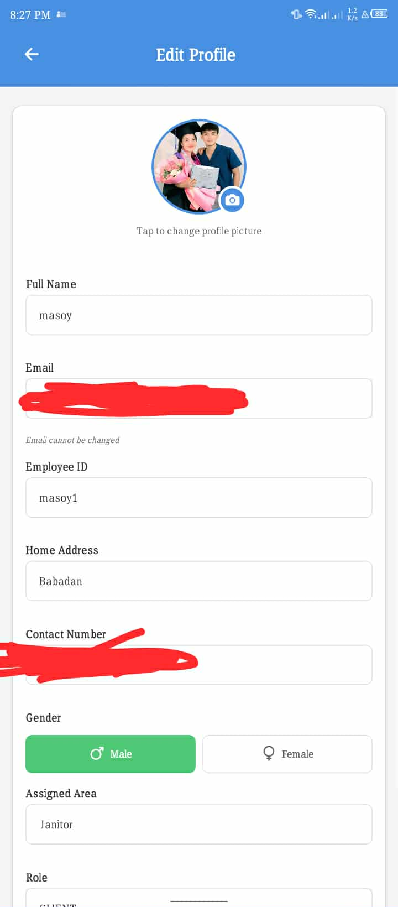

### Attendance Features
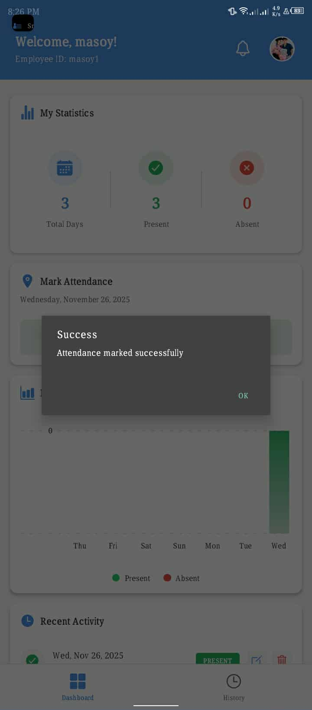
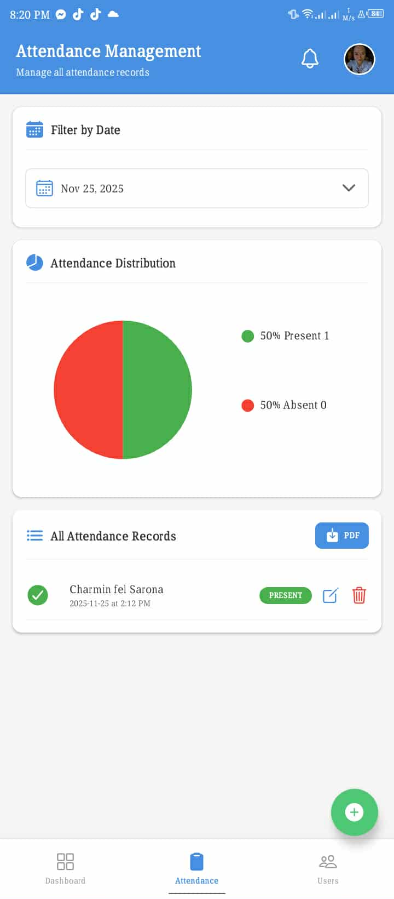
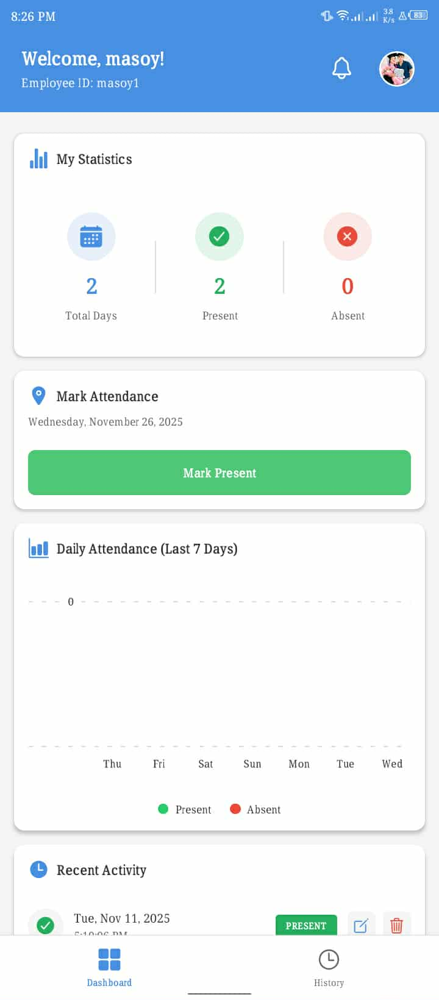

### Additional Features
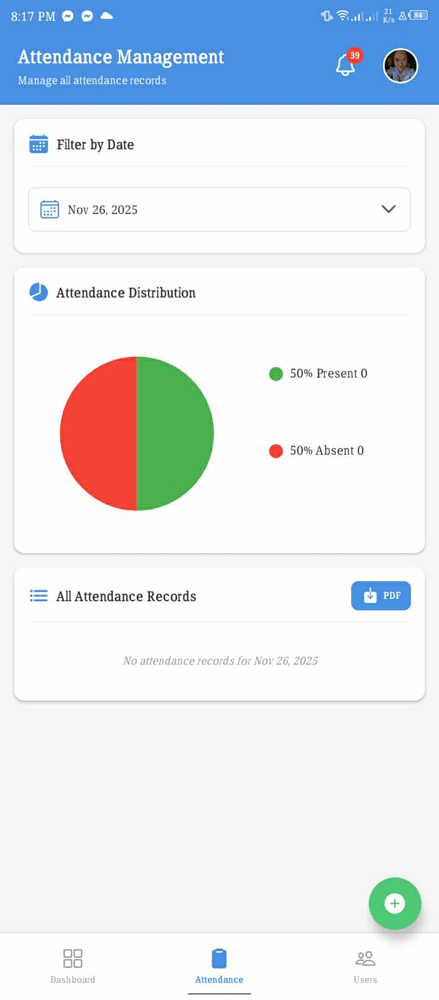
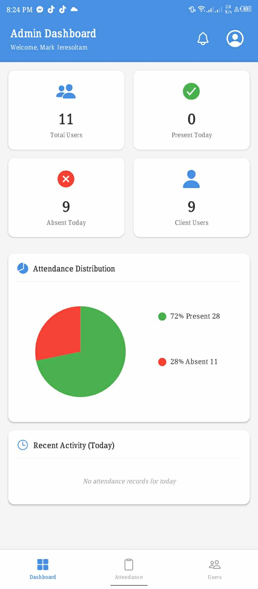

</div>

## System Architecture

### Tech Stack
- **Frontend**: React Native with Expo
- **Backend**: Firebase (Authentication & Firestore)
- **Navigation**: React Navigation
- **State Management**: Context API
- **Charts**: react-native-chart-kit (Pie & Bar charts)
- **Notifications**: expo-notifications
- **PDF Generation**: expo-print, expo-sharing
- **Image Handling**: expo-image-picker

### Project Structure
```
SAMS/
├── src/
│   ├── components/      # Reusable UI components
│   ├── config/          # Firebase and theme configuration
│   ├── context/         # Authentication context
│   ├── navigation/      # App navigation setup
│   ├── screens/         # App screens (Login, Dashboard, Profile)
│   └── services/        # API services (auth, attendance, users, notifications)
├── scripts/             # Database initialization & migration scripts
├── assets/              # Images and logo
├── App.js               # Main app entry point
├── app.json             # Expo configuration
├── package.json         # Dependencies
├── NOTIFICATIONS.md     # Push notification documentation
└── google-services.json # Firebase configuration
```

## Installation

### Prerequisites
- Node.js (v16 or higher)
- npm or yarn
- Expo CLI: `npm install -g expo-cli`

### Setup Steps

1. **Clone the repository**
   ```bash
   cd C:\Users\admin\Desktop\SAMS
   ```

2. **Install dependencies**
   ```bash
   npm install
   ```

3. **Firebase Setup**
   - Your `google-services.json` is already configured
   - The app uses the following Firebase services:
     - Authentication
     - Firestore Database

4. **Enable Firestore in Firebase Console**
   - Go to Firebase Console: https://console.firebase.google.com
   - Select your project: `smartattendance-92bd0`
   - Navigate to Firestore Database
   - Click "Create Database"
   - Choose "Start in test mode" for development
   - Select a location close to you

5. **Set Firestore Rules**
   The `firestore.rules` file contains security rules. Apply them in Firebase Console:
   ```
   rules_version = '2';
   service cloud.firestore {
     match /databases/{database}/documents {
       match /users/{userId} {
         allow read: if request.auth != null;
         allow write: if request.auth.uid == userId || get(/databases/$(database)/documents/users/$(request.auth.uid)).data.role == 'admin';
       }
       match /attendance/{attendanceId} {
         allow read: if request.auth != null;
         allow create: if request.auth != null;
         allow update, delete: if get(/databases/$(database)/documents/users/$(request.auth.uid)).data.role == 'admin';
       }
     }
   }
   ```

## Running the App

1. **Start Expo development server**
   ```bash
   npm start
   ```

2. **Run on your device**
   - Install "Expo Go" app on your Android/iOS device
   - Scan the QR code shown in the terminal
   - Or press `a` for Android emulator, `i` for iOS simulator

## User Roles

### Admin
- View all attendance records
- Manage all users
- Update/delete attendance records
- Access to admin dashboard with statistics

### Client (Employee)
- Mark daily attendance
- View personal attendance history
- Access to personal dashboard

## Default Test Accounts

After setting up Firebase, you can create test accounts:

**Admin Account:**
- Email: `admin@smartattendance.com`
- Password: `admin123`

**Client Account:**
- Email: `client@smartattendance.com`
- Password: `client123`

## 👥 User Accounts

The system includes pre-configured accounts for testing and development:

### 🛠️ System Accounts

| Role | Name | Email | Password | Employee ID |
|------|------|-------|----------|-----------|
| 👨‍💼 Admin | System Administrator | `admin@gmail.com` | `admin123` | ADMIN001 |
| 👨‍🎓 Student | Mark Jeresoltam | `markjeresoltam@gmail.com` | `student123` | STU001 |
| 👨‍🎓 Student | Fernando Geraldez | `fernandogeraldez@gmail.com` | `students123` | STU002 |
| 👨‍🎓 Student | Charmin Sarona | `charminsarona@gmail.com` | `students123` | STU003 |
| 👨‍🎓 Student | Aevan Krizl Alicante | `aevankrizlalicante@gmail.com` | `students123` | STU004 |
| 👨‍🎓 Student | Leo Renz Parilla | `leorenzparilla@gmail.com` | `students123` | STU005 |
| 👨‍🎓 Student | Abbie Josol | `abbiejosol@gmail.com` | `students123` | STU006 |

### 🔑 Quick Login

**Admin Access:**
```
Email: admin@gmail.com
Password: admin123
```

**Student Access (Example):**
```
Email: markjeresoltam@gmail.com
Password: student123
```

## CRUD Operations

### User Management (Admin only)
- **Create**: Register new users through registration screen
- **Read**: View all users in admin dashboard
- **Update**: Modify user details
- **Delete**: Remove users from system

### Attendance Management
- **Create**: Mark daily attendance
- **Read**: View attendance history (personal or all)
- **Update**: Admin can modify attendance status
- **Delete**: Admin can remove attendance records

## Firebase Collections

### users
```javascript
{
  uid: string,
  email: string,
  fullName: string,
  role: 'admin' | 'client',
  employeeId: string,
  homeAddress: string,          // NEW
  contactNumber: string,         // NEW
  gender: 'male' | 'female',     // NEW
  assignedArea: string,          // NEW
  profileImage: string (base64), // NEW
  pushToken: string,             // NEW - For notifications
  pushTokenUpdatedAt: timestamp, // NEW
  createdAt: timestamp,
  isActive: boolean
}
```

### attendance
```javascript
{
  userId: string,
  userName: string,
  status: 'present' | 'absent' | 'late',
  date: string (YYYY-MM-DD),
  timestamp: timestamp,
  checkInTime: string,
  createdAt: timestamp
}
```

## App Screens

1. **Login Screen** - User authentication with inline register link
2. **Register Screen** - New user registration with inline login link
3. **Client Dashboard** - Employee interface with bar chart and CRUD
4. **Admin Dashboard** - Control panel with pie chart, PDF reports, and FABs
5. **Profile Screen** - Edit profile with all user fields and image upload

## Features in Detail

### Authentication
- Email/password authentication via Firebase Auth
- Role-based access control
- Secure session management
- Auto-redirect based on user role

### Attendance System
- One attendance entry per user per day
- Automatic date tracking
- Status options: Present, Absent, Late
- Real-time updates
- CRUD operations for both admin and client users
- Sorting from newest to oldest

### Admin Dashboard (3 Tabs)
1. **Dashboard Tab**: 
   - Pie chart showing attendance distribution
   - Date range filtering
   - PDF report generation with sharing
   - Summary statistics (total users, present, absent)

2. **Attendance Tab**:
   - Floating action button (FAB) for adding attendance
   - Edit/delete operations
   - Recent activity (5 latest records)
   - Sorted from newest to oldest

3. **Users Tab**:
   - Floating action button (FAB) for adding users
   - User cards with profile images (48x48 circular avatars)
   - Edit/delete operations
   - Role indicators (admin/client)

### Client Dashboard
1. **Statistics Section**: Daily attendance stats
2. **Mark Attendance**: Quick attendance button
3. **Bar Chart**: 7-day attendance visualization (green=present, red=absent)
4. **Recent Activity**: Latest 5 records with edit/delete options

### Profile Management
- Upload profile images
- Edit all user fields (name, email, address, contact, gender, area)
- Gender toggle buttons (male/female)
- Base64 image storage in Firestore

### Push Notifications
- Daily reminders at 9:00 AM (local notifications)
- Instant confirmation when attendance marked
- Permission management (iOS/Android)
- Auto-cleanup on logout
- **⚠️ Note**: Push notifications require a **development build** for SDK 53+ (not Expo Go)
- See [NOTIFICATIONS.md](NOTIFICATIONS.md) for detailed documentation and setup

### Dashboard Features

**Client Dashboard:**
- Welcome greeting with user name
- Mark attendance button
- Attendance history (last 10 records)
- Total days count
- Pull-to-refresh functionality

**Admin Dashboard:**
- Statistics overview (total users, present today, total records)
- Tab-based navigation (Attendance/Users)
- Complete attendance records with edit/delete
- User list with role badges
- Real-time data updates

## Troubleshooting

### Common Issues

1. **Expo won't start**
   - Clear cache: `expo start -c`
   - Reinstall dependencies: `rm -rf node_modules && npm install`

2. **Firebase connection error**
   - Verify `google-services.json` is in project root
   - Check Firebase configuration in `src/config/firebase.js`
   - Ensure Firebase services are enabled in console

3. **Can't create users**
   - Enable Email/Password authentication in Firebase Console
   - Check Firestore rules are properly set

4. **Push Notifications Warning in Expo Go**
   - Expected behavior: Expo Go doesn't support push notifications in SDK 53+
   - Local notifications still work for testing
   - For full features, create a development build: `eas build --profile development --platform android`
   - More info: https://docs.expo.dev/develop/development-builds/introduction/
   - Check Firestore rules are properly set

## Development

### File Structure Guide

- **components/** - Reusable UI components (Button, Card, TextInput, etc.)
- **config/** - Configuration files (Firebase, theme)
- **context/** - React Context for state management
- **screens/** - Full screen components
- **services/** - Business logic and API calls
- **navigation/** - Route configuration

### Adding New Features

1. Create service functions in `services/`
2. Build UI components in `components/`
3. Create screen in `screens/`
4. Add route in `navigation/AppNavigator.js`

### Database Scripts

Located in `scripts/` directory:

- **initializeDatabase.js** - Create Firebase collections and initial structure
- **createInitialUsers.js** - Generate admin and client test accounts
- **migrateUserData.js** - Add new fields to existing users (homeAddress, contactNumber, gender, assignedArea)
- **autoMigration.js** - Add 35 sample attendance records
- **testNotifications.js** - Display notification implementation guide
- **testFirebaseConnection.js** - Verify Firebase connectivity

Run scripts with: `node scripts/<script-name>.js`

## 📚 API Documentation

### Firebase Collections Structure

#### Users Collection
```javascript
// Path: /users/{userId}
{
  uid: string,
  email: string,
  fullName: string,
  role: 'admin' | 'client',
  employeeId: string,
  homeAddress: string,
  contactNumber: string,
  gender: 'male' | 'female',
  assignedArea: string,
  profileImage: string, // base64 encoded
  pushToken: string,
  createdAt: timestamp,
  isActive: boolean
}
```

#### Attendance Collection
```javascript
// Path: /attendance/{attendanceId}
{
  userId: string,
  userName: string,
  status: 'present' | 'absent' | 'late',
  date: string, // YYYY-MM-DD format
  checkInTime: string,
  timestamp: timestamp,
  createdAt: timestamp
}
```

### Available Scripts

| Script | Purpose | Usage |
|--------|---------|-------|
| `initializeDatabase.js` | Setup Firebase collections | `node scripts/initializeDatabase.js` |
| `createInitialUsers.js` | Create test user accounts | `node scripts/createInitialUsers.js` |
| `testFirebaseConnection.js` | Verify Firebase connectivity | `node scripts/testFirebaseConnection.js` |
| `migrateUserData.js` | Update user schema | `node scripts/migrateUserData.js` |
| `autoMigration.js` | Add sample attendance data | `node scripts/autoMigration.js` |

## Security Considerations

- Never commit Firebase private keys to version control
- Use environment variables for sensitive data
- Implement proper Firestore security rules
- Validate all user inputs
- Use HTTPS for all API calls

## Future Enhancements

- [x] ~~Push notifications for attendance reminders~~ ✅ **COMPLETED**
- [x] ~~Attendance reports export (PDF)~~ ✅ **COMPLETED**
- [x] ~~Data visualization (Charts)~~ ✅ **COMPLETED**
- [x] ~~Profile image upload~~ ✅ **COMPLETED**
- [ ] QR code-based attendance
- [ ] GPS location verification
- [ ] Leave management system
- [ ] Multiple shift support
- [ ] Biometric authentication
- [ ] Export to Excel format
- [ ] Email notifications
- [ ] Customizable reminder times

## Support

For issues or questions:
- Check Firebase Console for backend errors
- Review Expo logs for frontend errors
- Ensure all dependencies are properly installed

## GitHub Repository

🔗 **Project Repository**: [Smart-Attendance-Management-System](https://github.com/markjeresoltam21/Smart-Attendance-Management-System)

Clone the repository:
```bash
git clone https://github.com/markjeresoltam21/Smart-Attendance-Management-System.git
cd Smart-Attendance-Management-System
```

### 📈 Repository Statistics

- **Language**: JavaScript (React Native)
- **Framework**: Expo SDK 53+
- **Database**: Firebase Firestore
- **Authentication**: Firebase Auth
- **Total Files**: 100+
- **Development Status**: Active

## 🤝 Contributing

We welcome contributions to improve SAMS! Here's how you can help:

### 🛠️ Development Setup

1. **Fork the repository**
2. **Clone your fork**:
   ```bash
   git clone https://github.com/YOUR_USERNAME/Smart-Attendance-Management-System.git
   cd Smart-Attendance-Management-System
   ```
3. **Install dependencies**:
   ```bash
   npm install
   ```
4. **Create a feature branch**:
   ```bash
   git checkout -b feature/your-feature-name
   ```
5. **Make your changes and commit**:
   ```bash
   git commit -m "Add your meaningful commit message"
   ```
6. **Push and create a Pull Request**

### 📋 Contribution Guidelines

- Follow the existing code style and structure
- Add meaningful commit messages
- Update documentation for new features
- Test your changes thoroughly
- Include screenshots for UI changes

### 🐛 Reporting Issues

Found a bug? Please create an issue with:
- Clear description of the problem
- Steps to reproduce
- Expected vs actual behavior
- Screenshots (if applicable)
- Device/OS information

## License

This project is for educational/internal use.

---

Built with ❤️ using React Native & Firebase by **Mark Jere Soltam Ayala Gementiza**
